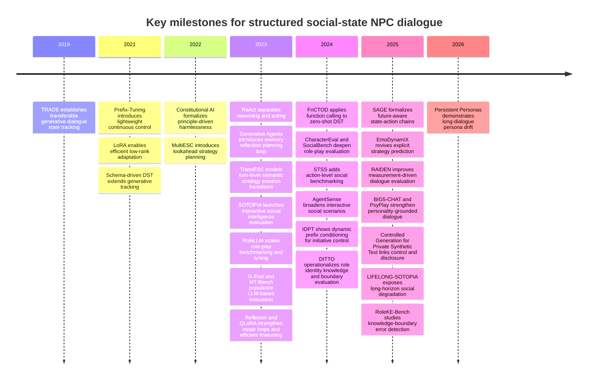
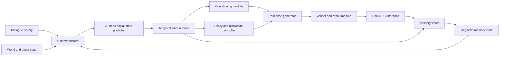

# Structured Social-State Supervision for Controllable NPC Dialogue

## Executive summary

The literature most relevant to **Structured Social-State Supervision for Controllable NPC Dialogue** has converged on a clear but still incomplete picture. The field now has strong results on slot-style dialogue state tracking, explicit strategy planning for multi-turn support dialogue, role-playing and social-intelligence benchmarks, memory-reflection-planning agent architectures, verifier/repair loops, and parameter-efficient conditioning. What it still lacks is a unified formulation in which **social state itself is explicitly supervised, temporally propagated, disclosure-aware, and connected to controllable response generation under realistic deployment constraints**. That gap is precisely where a 29-head social-state schema can make a publishable contribution. citeturn14view4turn17view0turn14view2turn16view4turn17view6turn17view1turn17view2turn15view5turn17view3turn15view8turn16view2turn15view11turn21search0turn21search1

The most defensible positioning for the paper is **not** that NPC dialogue needs memory, persona, or benchmarks; those points are already well established. Rather, the strongest claim is that prior work tends to choose one of three incomplete abstractions: narrow slot-value state, loosely specified natural-language memory, or low-dimensional latent strategy/state variables. Your proposed contribution is stronger if framed as a **mid-level, supervised social-state representation** that sits between raw interaction history and utterance generation, and that is expressly designed to regulate **trajectory consistency, character knowledge boundaries, disclosure policy, and controllable style/strategy** over long horizons. That framing is consistent with the most important findings from role-play evaluation, longitudinal social-agent benchmarks, and recent work showing both persona drift over long dialogues and the fragility of pure LLM-judge evaluation. citeturn17view5turn27view0turn33view0turn26view2turn26view3turn17view1turn17view2turn19view1turn26view0turn24search3

For a NeurIPS-facing submission, emphasize **structured latent supervision, controllability, temporal evaluation, and verifier-aware training**. For a SIGGRAPH-facing submission, emphasize **believability, NPC continuity, world- and social-state grounding, and player-facing immersion**. The same technical core can support both narratives if the manuscript makes the state representation central rather than peripheral. citeturn17view3turn15view18turn18view2turn18view3turn17view6

## Conceptual frame and taxonomy

The clearest way to organize the prior literature around your 29-head schema is to treat it as a factorization of social interaction into six coupled blocks: **scene grounding**, **affect**, **mental-model inference**, **relational stance**, **norms/disclosure**, and **response policy**. Existing work usually supervises only one or two of these blocks at a time. Dialogue state tracking supervises user-goal structure but largely ignores interpersonal stance and disclosure. Emotional-support and latent-strategy work models affect and strategy transitions but usually under domain-specific label sets. Role-playing systems supervise persona and knowledge style, but often leave disclosure and social goals implicit. Agent architectures model memory and planning in natural language, but without explicit typed supervision. Safety and verifier work adds post hoc correction, but often without a persistent social-state representation to govern generation turn by turn. citeturn14view4turn32search8turn17view0turn14view2turn16view4turn15view17turn17view6turn17view5turn27view0turn17view3turn16view2turn28view0

This taxonomy is useful because it reveals an important design principle: **the most valuable supervision signal is not a single latent “persona” vector but a structured bundle of partially observable social variables with different temporal scales**. Some heads should change quickly, such as local emotion and short-term conversational intent. Others should change slowly, such as rapport, trust calibration, or cognitive boundaries. Others should remain nearly invariant, such as stable character identity constraints. That temporal heterogeneity is under-modeled in current work, even when long-horizon dialogue is discussed. citeturn16view4turn17view6turn18view0turn26view0

The following timeline situates the most relevant papers and benchmarks for the paper’s likely literature review. citeturn14view4turn15view11turn21search0turn16view2turn14view2turn13search14turn16view1turn15view8turn17view1turn17view5turn15view14turn15view15turn17view0turn15view5turn17view2turn33view0turn26view2turn17view6turn15view17turn16view5turn19view1turn26view0

## Structured control and state supervision

The line of work closest to your formulation is the one that makes intermediate dialogue state explicit. In task-oriented dialogue, **TRADE** showed that generative state tracking can represent dialogue state as text rather than fixed classification heads, improving transfer to unseen slots and domains. **Schema-Driven Prompting** extended that logic by letting a language model condition on task schema directly, and **FnCTOD** showed that modern LLM function-calling can substantially improve zero-shot dialogue state tracking in new domains. The methodological lesson is important: explicit state is useful, but most DST work assumes user-goal slots and tool schemas rather than rich interpersonal state. For your paper, DST provides the conceptual foundation for structured supervision, but not the right ontology. citeturn14view4turn32search8turn17view0

A second line of work moves from slot state to **strategy and transition state**. **MultiESC** introduced lookahead strategy planning for multi-turn emotional support, explicitly modeling future user feedback and subtle user-state cues. **TransESC** then argued that multi-turn support quality depends on turn-level transition structure across semantics, strategy, and emotion. **EmoDynamiX** continued that trend by explicitly predicting supportive strategy from mixed emotions and discourse dynamics rather than relying on fully implicit end-to-end generation. The newest step in this direction is **SAGE**, whose State-Action Chain introduces latent variables for emotional state and conversational strategy prior to response generation, giving the model a higher-level controllable planning substrate. These papers are methodologically close to your idea because they accept that long-horizon dialogue quality depends on latent or semi-latent state that should evolve across turns. Their limitation is that their state spaces are still relatively small and domain-bound compared with a broad social-state schema. citeturn14view2turn16view4turn15view17turn17view6

A third, highly practical strand concerns **conditioning mechanisms** for controllable dialogue. **Prefix-Tuning** introduced continuous prefix vectors as a lightweight control mechanism for generation, while **IDPT** showed that such prefixes can be dynamically selected or mixed to control conversational initiative even under sparse or zero initiative labels. This matters for your project because it suggests a natural architectural decomposition: the 29-head state predictor need not be the generator itself; it can instead drive lightweight control channels into a generator, which is especially important if deployment on smaller models matters. citeturn15view11turn31view0

The central conclusion from this cluster is that the field already accepts the need for intermediate control variables, but existing systems typically choose **either** narrow symbolic state **or** underspecified low-dimensional latent state. A 29-head supervised social-state representation is publishable if it is argued as a **middle layer**: richer than DST slots, more interpretable than free-form memory, and more scalable than bespoke strategy labels. citeturn14view4turn17view0turn14view2turn17view6

## Role-play, social intelligence, and character consistency

The role-playing literature is essential because controllable NPC dialogue is not only about coherence; it is about **remaining in character while navigating social context**. **RoleLLM** was a major step because it turned role-play into a benchmark-and-training problem, constructing role profiles, prompts, and a large benchmark for character-level tuning. **DITTO** sharpened the formulation by decomposing role-play into three objectively judged aspects: consistent role identity, accurate role-related knowledge, and rejection of out-of-bound questions. That third component is especially important for your work because it directly anticipates a disclosure-aware or cognitive-boundary head in a structured schema. citeturn17view5turn27view0

Evaluation work has since become much more rigorous. **CharacterEval** proposed a comprehensive, multi-dimensional framework including conversational ability, knowledge consistency, persona consistency, attractiveness, and personality back-testing. **RAIDEN** moved further toward dialogue-native measurement by evaluating staged dimensions at different parts of a conversation and by introducing a specialized judge tuned to role-play assessment. **SocialBench** expanded the scope from individual character fidelity to sociality at both individual and group levels, showing that strong single-agent performance does not imply strong group-social behavior. **CharacterBox** then argued that role-play should be evaluated in an interactive virtual world rather than only from static dialogue or self-report. Together, these papers establish that believable NPCs require more than style mimicry: they require stable knowledge boundaries, social competence, and multi-turn robustness. citeturn33view0turn26view2turn26view3turn15view2

The social-intelligence benchmark literature reaches a similar conclusion from a different direction. **SOTOPIA** introduced open-ended interactive scenarios with social goals and holistic evaluation. **STSS** argued that language-only scoring is insufficient and pushed evaluation to the action level inside a multi-agent sandbox. **AgentSense** expanded scenario diversity and complexity for interactive social reasoning, and **LIFELONG-SOTOPIA** made a particularly important point for your paper: even with memory, agent believability and goal achievement degrade across multi-episode interactions, especially when past interaction history must be used correctly over time. This is exactly the empirical pressure that motivates persistent social-state supervision. citeturn17view1turn15view5turn17view2turn19view1

Recent meta-evaluation further strengthens your case. **PersonaEval** shows that current LLM evaluators are still substantially worse than humans at the role-identification prerequisite needed for reliable role-play judgment, and **Persistent Personas?** shows that persona fidelity degrades over long dialogues, especially in goal-oriented settings. The implication is straightforward: your paper should not treat “LLM-as-a-judge says it stayed in character” as sufficient evidence. It should instead rely on explicit trajectory-level metrics, sampled human adjudication, and head-level consistency analysis. citeturn24search3turn26view0

For the 29-head schema, this cluster is the strongest argument for including separate heads for **role identity stability, character knowledge boundary, relational stance, social goal tracking, epistemic uncertainty, and disclosure/refusal policy**. Those variables are present in the tasks, but rarely supervised together. citeturn27view0turn33view0turn26view2turn17view1turn19view1

## Generative agents, NPC dialogue, and safety

The agent-architecture literature contributes the missing high-level systems view. **Generative Agents** made memory, reflection, and planning the core loop for believable social behavior in a sandbox environment, and showed through ablations that each component matters. **ReAct** separated reasoning and external action, improving interpretability and adaptivity. **Reflexion** added verbal reinforcement through iterative memory updates rather than weight updates. These works are architecturally influential because they show how behavior quality improves when response generation is no longer a single forward pass from dialogue history to text. Their main limitation for your problem is that they rely heavily on **unstructured natural-language memory**, which is flexible but difficult to supervise, evaluate, and constrain for disclosure or policy compliance. citeturn17view3turn16view1turn15view8

The NPC and games literature is still younger and more prototype-driven, but it is already relevant. The survey **Large Language Models and Games** shows that game research has increasingly moved toward dialogue, player modeling, narrative systems, and mixed-initiative interaction. Prototype systems for LLM-driven NPCs have explored **cross-platform continuity** and **environmental grounding**, for example by synchronizing NPC dialogue history across a game client and an external social platform, or by injecting panoramic environmental perception into dialogue generation. The common pattern is that researchers want NPCs to be more grounded, persistent, and immersive, but the state that mediates those properties is usually implicit in logs, prompts, or retrieved text. That is exactly where a structured social-state layer can differentiate itself. citeturn15view18turn18view3turn18view2

Safety and disclosure policy work is especially important if the paper claims controllability rather than mere stylistic vividness. **Constitutional AI** established principle-driven harmlessness and self-critique as a scalable alignment strategy. **Controlled Generation for Private Synthetic Text** is relevant because it links controllable generation to privacy-preserving control codes and prefix-based steering. In role-play settings, **DITTO** operationalizes “unknown question rejection,” and **RoleKE-Bench** shows that LLMs often fail to detect both known-knowledge and unknown-knowledge errors, especially when the model can easily bluff with semantically plausible but incorrect content. Meanwhile, **Self-Refine** and **CRITIC** demonstrate the broader utility of generator–critic–reviser loops and external verification at inference time. The methodological gap is that these safety or repair mechanisms are usually attached **after** generation or via a separate principle list, rather than being embedded in a persistent, supervised social-state model that regulates what the character may reveal, infer, or refuse. citeturn16view2turn16view5turn27view0turn28view0turn15view9turn15view10

A strong figure to adapt or cite in the manuscript would juxtapose the **memory–reflection–planning loop** from *Generative Agents* with the **State-Action Chain** schematic from *SAGE*. That pairing visually clarifies your claim: previous systems either keep control variables in natural-language memory or in a small latent chain, whereas your method inserts a typed supervised social-state layer between memory and generation. citeturn13search14turn17view6

## Efficient adaptation, small models, and affect conditioning

If the target application is game or simulation deployment, efficiency is not incidental; it is core methodology. **LoRA** showed that low-rank adaptation can match or exceed full fine-tuning while dramatically reducing trainable parameters and memory cost, and **QLoRA** extended that result to quantized finetuning, enabling much larger models to be adapted under limited hardware budgets. **Prefix-Tuning** gives a second family of control mechanisms that are especially attractive when the control state can be injected continuously rather than by retraining the whole model. These methods are relevant not merely as engineering tricks, but because they make a structured-state architecture experimentally feasible across multiple ablations and model scales. citeturn21search0turn21search1turn15view11

The small-model literature strengthens this point. **Small Language Models Need Strong Verifiers to Self-Correct Reasoning** argues that compact models often benefit substantially from stronger verification signals and can fail when asked to self-verify with weak internal critics. For your paper, that suggests a practical design: use a relatively compact dialogue model conditioned on explicit social-state heads, but pair it with a stronger or specialized verifier for disclosure, contradiction, and state-to-response consistency during training or offline repair. In other words, structured social-state supervision and verifier-based correction are complementary, not competing, paradigms. citeturn20search0

On personality and affect, the literature is now mature enough to support a principled encoder story. The survey on **Personality, Persona, and Profile in Conversational Agents** clarifies the distinction between surface persona facts and deeper personality conditioning. **PELD** is especially relevant because it explicitly ties the Big Five personality model to **VAD** affective dynamics and models personality as a weight on mood transition. **PsyPlay** then demonstrates that deeper personality expression, not just speaking style, improves role-playing fidelity. **BIG5-CHAT** pushes further by providing a large, human-grounded Big Five dialogue dataset and showing that training-based personality induction can outperform prompting on personality-alignment measures. The key lesson for your paper is that OCEAN/VAD-style signals are best used as **structured auxiliaries** to a broader social-state model. They are powerful for affect and stable disposition, but insufficient on their own for disclosure policy, epistemic boundaries, or long-horizon relational control. citeturn30view2turn29view1turn17view4turn30view0

## Evaluation blueprint

The evaluation literature now strongly suggests that a publishable system in this area must separate four questions: **Did the model infer the right social state? Did it maintain the right state over time? Did it generate the right utterance given that state? And did it avoid leaking or fabricating what the character should not reveal or know?** Benchmarks such as CharacterEval, RAIDEN, SocialBench, SOTOPIA, STSS, and LIFELONG-SOTOPIA supply pieces of that picture, while G-Eval and MT-Bench show how LLM-judge frameworks can be useful but not self-sufficient. citeturn33view0turn26view2turn26view3turn17view1turn15view5turn19view1turn15view14turn15view15turn24search3

The architecture implied by the strongest prior work, but not yet cleanly instantiated in the literature, is a typed interaction stack in which memory, state, policy, generation, and repair are distinct modules. citeturn17view3turn17view6turn15view9turn15view10turn20search0

The following metric suite is the most compelling evaluation package for a paper in this area.

| Metric | Purpose | Measurement method |
|---|---|---|
| **Head-wise macro-F1 / AUROC** | Measures whether each social-state head is inferable at all | Per-head classification or regression metrics against human annotations on held-out dialogue turns |
| **Trajectory consistency score** | Measures whether state evolves plausibly over time | Sequence accuracy, edit distance, contradiction rate, and empirical transition violation counts across state trajectories |
| **Response conditionality** | Tests whether output is actually controlled by the state | Counterfactual decoding: hold dialogue fixed, perturb one head, and measure targeted semantic change without unrelated drift |
| **Character knowledge accuracy** | Distinguishes correct in-character knowledge from hallucination | CharacterEval-style knowledge accuracy/hallucination + evidence-grounded manual checks |
| **Cognitive-boundary refusal accuracy** | Measures disclosure and unknown-question handling | DITTO/RoleKE-style tests on out-of-scope, anachronistic, or forbidden information prompts |
| **Semantic leakage rate** | Measures accidental exposure of latent labels or forbidden internal state | Regex + NLI + judge-based auditing for explicit head leakage, annotation-token leakage, and policy-forbidden disclosure |
| **Social goal completion** | Measures whether dialogue advances interpersonal objectives | SOTOPIA/STSS/AgentSense-style task success or reward under interactive simulation |
| **Human pairwise preference** | Anchors believability and usefulness | Blinded pairwise comparisons on consistency, appropriateness, immersion, and disclosure correctness |
| **LLM-judge rubric with calibration** | Scales evaluation while limiting cost | G-Eval-style rubric judging, but calibrated against a human-rated subsample and audited for judge error |
| **Efficiency metrics** | Makes small-model conditioning claims credible | Latency, tokens/turn, VRAM, finetuning cost, verifier overhead, and quality–cost trade-off curves |

This metric suite is not merely additive; it encodes an argument. If a paper reports only response quality, it can miss broken state estimation. If it reports only head prediction, it can miss broken generation. If it reports only LLM-judge scores, it can miss role-identification failure or temporal drift. A rigorous evaluation should therefore couple **head-level supervision**, **trajectory-level diagnostics**, **boundary/disclosure tests**, and **human-calibrated open-ended judgment**. That recommendation follows directly from the strengths and limitations of CharacterEval, RAIDEN, SOTOPIA, LIFELONG-SOTOPIA, G-Eval, MT-Bench, and PersonaEval. citeturn33view0turn26view2turn17view1turn19view1turn15view14turn15view15turn24search3

## Gap analysis, recommended citation list, and open questions

The literature points to five concrete gaps that strongly motivate the proposed contribution.

First, there is a **representation gap**. Task-oriented dialogue state tracking gives us explicit state, but the ontology is too narrow for social NPC interaction. By contrast, generative-agent and role-playing systems often keep socially important variables in free text or prompt residue, which is flexible but hard to supervise and hard to evaluate. A 29-head schema directly addresses this by making interpersonal variables first-class model outputs. citeturn14view4turn17view0turn17view3turn17view5

Second, there is a **control gap**. MultiESC, TransESC, EmoDynamiX, and SAGE demonstrate the value of intermediate strategy or latent state, but their control spaces remain relatively low-dimensional and domain-specific. Your approach can claim novelty if it generalizes this idea from “strategy labels” or “state-action chains” to a broader social-state ontology that supports both open-ended dialogue and explicit policy constraints. citeturn14view2turn16view4turn15view17turn17view6

Third, there is a **disclosure gap**. Boundary-awareness is now recognized in role-play evaluation and safety research, but mostly as an evaluation dimension, a critique rule, or a post hoc repair target. The missing step is to treat disclosure policy and cognitive boundary as **persistent supervised state** that can be predicted, updated, and verified every turn. That is one of the strongest places where your paper can make a clean methodological contribution. citeturn27view0turn28view0turn16view2turn16view5

Fourth, there is an **efficiency gap**. Much of the most believable dialogue work assumes large models and rich natural-language memory. PEFT methods make deployment feasible, but the literature does not yet systematically combine compact conditioning, structured social-state supervision, and verifier-aware generation for NPC dialogue. That combination is publishable because it is both scientifically motivated and systems-relevant. citeturn15view11turn21search0turn21search1turn20search0

Fifth, there is an **evaluation gap**. Short-horizon, judge-heavy evaluation still dominates, despite evidence from longitudinal benchmarks and role-play meta-evaluation that persona fidelity decays and that judge models have nontrivial blind spots. A paper that evaluates **temporal consistency, semantic leakage, disclosure correctness, and human alignment together** will be substantially more rigorous than much of the current literature. citeturn19view1turn26view0turn24search3turn15view14turn15view15

### Comparison table of representative works and the proposed approach

| Work | Stateful | Supervised latent | Disclosure-aware | Temporal evaluation | Small-model conditioning | Relevance to the proposed 29-head schema |
|---|---:|---:|---:|---:|---:|---|
| TRADE (ACL 2019) citeturn14view4 | Yes | No | No | Limited | No | Establishes explicit state tracking, but only for slot/value task state |
| FnCTOD (arXiv 2024) citeturn17view0 | Yes | Partial | Partial | Limited | Partial | Extends explicit state to LLM tooling, still task-schema centered |
| MultiESC / TransESC (EMNLP 2022 / Findings ACL 2023) citeturn14view2turn16view4 | Yes | Partial | No | Yes | No | Strong precedent for turn-level emotional and strategy transitions |
| SAGE with SAC (2025) citeturn17view6 | Yes | Yes | No | Yes | Partial | Closest latent-control precedent; still lower-dimensional than a broad social schema |
| DITTO / RoleKE-Bench (ACL 2024 / EMNLP 2025) citeturn27view0turn28view0 | Partial | No | Yes | Partial | Partial | Strong support for modeling boundary, refusal, and knowledge correctness |
| CharacterEval / RAIDEN (ACL 2024 / COLING 2025) citeturn33view0turn26view2 | N/A | N/A | Partial | Yes | N/A | Strong evaluation precedents for persona, knowledge, and staged dialogue analysis |
| SOTOPIA / STSS / AgentSense / LIFELONG-SOTOPIA citeturn17view1turn15view5turn17view2turn19view1 | N/A | N/A | Partial | Yes | N/A | Supply social-goal and long-horizon evaluation, but not structured internal supervision |
| Generative Agents (UIST 2023) citeturn13search14turn17view3 | Yes | No | No | Yes | No | Shows value of persistent memory/planning, but state remains untyped natural language |
| **Proposed structured social-state supervision** | **Yes** | **Yes** | **Yes** | **Yes** | **Yes** | **Unifies explicit social-state prediction, controllable generation, disclosure policy, and deployable conditioning** |

### Recommended citation list

The following citations are the highest-value core set for a conference literature review and positioning section.

- Wu et al., **TRADE: Transferable Multi-Domain State Generator for Task-Oriented Dialogue Systems**, ACL 2019. Foundational explicit-state tracking reference. citeturn14view4
- Lee et al., **Dialogue State Tracking with a Language Model using Schema-Driven Prompting**, EMNLP 2021. Useful bridge from symbolic state to language-model state tracking. citeturn32search8
- Li et al., **Large Language Models as Zero-shot Dialogue State Tracker through Function Calling**, arXiv 2024. Strong modern DST baseline for open-LLM control. citeturn17view0
- Cheng et al., **Improving Multi-turn Emotional Support Dialogue Generation with Lookahead Strategy Planning**, EMNLP 2022. Important for explicit long-horizon strategy planning. citeturn14view2
- Zhao et al., **TransESC: Smoothing Emotional Support Conversation via Turn-Level State Transition**, Findings ACL 2023. Important for trajectory-aware state transitions. citeturn16view4
- Zhang and Jaitly, **SAGE: Steering Dialog Generation with Future-Aware State-Action Augmentation**, 2025. Closest prior to future-aware latent state/action control. citeturn17view6
- Wang et al., **RoleLLM: Benchmarking, Eliciting, and Enhancing Role-Playing Abilities of Large Language Models**, arXiv 2023. Major role-play benchmark/training reference. citeturn17view5
- Lu et al., **Attaining Arbitrary Role-play via Self-Alignment**, ACL 2024. Cite for DITTO and boundary-aware role-play evaluation. citeturn27view0
- Tu et al., **CharacterEval**, ACL 2024. Strong multi-dimensional character-consistency benchmark. citeturn33view0
- Wu et al., **RAIDEN Benchmark**, COLING 2025. Dialogue-native, staged role-play evaluation reference. citeturn26view2
- Zhou et al., **SOTOPIA**, arXiv 2023, plus Goel and Zhu, **LIFELONG-SOTOPIA**, arXiv 2025. Use together for social-goal and long-horizon evaluation positioning. citeturn17view1turn19view1
- Park et al., **Generative Agents: Interactive Simulacra of Human Behavior**, UIST 2023. Central architecture reference for memory/reflection/planning NPC-like agents. citeturn13search14turn17view3
- Bai et al., **Constitutional AI: Harmlessness from AI Feedback**, arXiv 2022. Core policy/disclosure alignment reference. citeturn16view2
- Madaan et al., **Self-Refine**, arXiv 2023, and Gou et al., **CRITIC**, OpenReview 2024. Best pair for verifier/repair modules. citeturn15view9turn15view10
- Li and Liang, **Prefix-Tuning**, ACL 2021; Hu et al., **LoRA**, ICLR 2022; Dettmers et al., **QLoRA**, NeurIPS 2023. Core efficiency and conditioning trio. citeturn15view11turn21search0turn21search1
- Wen et al., **Personality-affected Emotion Generation in Dialog Systems**, 2024, and BIG5-CHAT, ACL 2025, plus Yang et al., **PsyPlay**, 2025. Core affect/personality grounding set. citeturn29view1turn30view0turn17view4
- Liu et al., **G-Eval**, EMNLP 2023, Zheng et al., **MT-Bench and Chatbot Arena**, 2023, and Zhou et al., **PersonaEval**, 2025. Essential evaluation-trustworthiness set. citeturn15view14turn15view15turn24search3

### Open questions and limitations

Two limitations of the current literature should be stated explicitly in the review. First, several influential role-play and social-agent papers are still **arXiv-first or benchmark-first**, so archival maturity is uneven across subareas. Second, there is still no widely accepted gold-standard dataset for **joint social-state supervision plus generation plus disclosure correctness**; your paper will therefore need to justify its annotation design and its evaluator calibration very carefully. citeturn17view5turn17view1turn17view2turn24search3

The most important open research questions are these. Can a structured social-state layer improve both **controllability and believability** without making responses feel over-scripted? Which heads should be **persistent memory**, which should be **predicted online**, and which should be **verifier-corrected** after generation? And can small-model systems conditioned on explicit state match larger-model baselines on long-horizon role fidelity once evaluation is made trajectory-aware rather than turn-local? Those are the questions that, if answered cleanly, would make the paper feel not incremental but agenda-setting. citeturn17view6turn17view3turn20search0turn26view0