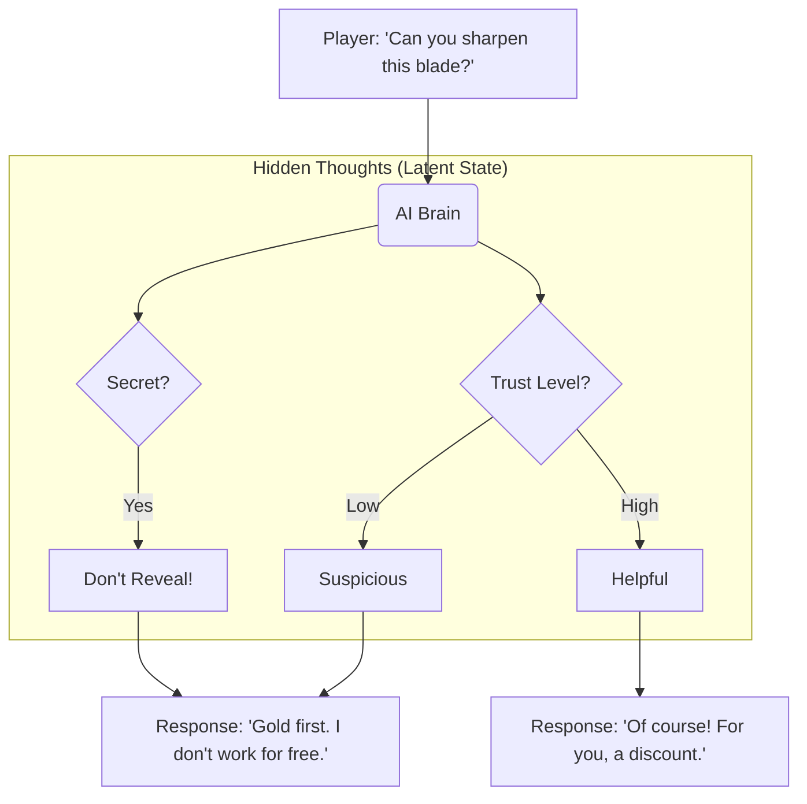

# 🎓 Teaching AI to "Read the Room": A Guide to Social Simulation

**Target Audience:** High School & College Freshmen  
**Goal:** Understand how we train AI to be better roleplayers in games and simulations.

---

## 🎭 The Problem: Why are Video Game NPCs So Boring?

Have you ever played an RPG (Role-Playing Game) like *Skyrim* or *Cyberpunk*? You talk to a guard, and they say:
> *"I used to be an adventurer like you, then I took an arrow in the knee."*

Then you talk to them again, and they say... **the exact same thing.**

Current AI chatbots (like ChatGPT) are better, but they still have a problem: **they don't have a memory of "relationships" or "hidden goals."** They just predict the next word. They don't "feel" trust or suspicion.

### 💡 The Solution: Giving AI a "Social Brain"

We are building a system that gives AI characters **Latent State**—a fancy word for "hidden thoughts and feelings."

Instead of just going `Input -> Output`, our AI goes:
`Input -> [Think about Trust/Secrets/Goals] -> Output`

---

## 🧩 How It Works (The Flow)

Imagine you are talking to a **Blacksmith** in a game. You want to buy a sword, but you also want to find out if he's hiding a secret rebel leader.

### 1. The "Hidden Layers"
We teach the AI to track 6 key things during a conversation:
1.  **Trust:** Do I like you? (0 to 100)
2.  **Secrets:** What am I hiding?
3.  **Goals:** What do I want from you?
4.  **Mood:** Am I angry, happy, or scared?
5.  **Social Norms:** Am I allowed to be rude?
6.  **Dialogue Act:** Am I asking a question or making a command?

### 2. The Training Process (Like School)
We don't just program these rules. We **train** a small AI model to learn them by watching a "Teacher" AI (a giant brain like GPT-4).

1.  **Teacher Generates Data:** The Teacher plays out thousands of conversations, labeling every thought.
2.  **Student Studies:** The small AI (Student) reads these logs and tries to guess the labels.
3.  **Test:** We let the Student play the game. If it acts inconsistently (e.g., trusting a stranger too fast), we correct it.

---

## 🎮 Try It Yourself! (Interactive Concept)

Imagine you are the AI. Read this context and decide the response.

**Context:**
*   **Role:** Guard
*   **Secret:** The King is dead (but no one knows yet).
*   **Player says:** "Why are the gates closed? Is the King safe?"

**Which internal thought is better?**

*   **Option A:** `[Trust: High] [Reveal Secret: Yes]` -> "Yes, sadly he passed away."
*   **Option B:** `[Trust: Low] [Reveal Secret: No] [Strategy: Deflect]` -> "Orders from above. Move along, citizen."

*(Answer: Probably B! A guard shouldn't spill state secrets to a random person.)*

---

## 🚀 Why This Matters?

This isn't just for games!
*   **Training:** Doctors can practice breaking bad news to "virtual patients" that react realistically.
*   **Negotiation:** Business students can practice deals with AI that has "hidden agendas."
*   **Psychology:** We can model how trust builds (or breaks) over time.

---

### 📚 Vocabulary
*   **Latent State:** Hidden variables (like mood or trust) that affect behavior but aren't seen directly.
*   **Inference:** The AI making a prediction.
*   **Training Data:** Examples used to teach the AI.
*   **NPC:** Non-Player Character.
