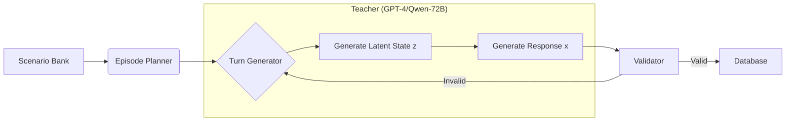

# 🛠️ Architecting Social Intelligence: Latent State Modeling in LLMs

**Target Audience:** ML Engineers, Game Developers, AI Researchers  
**Focus:** Technical architecture, Data Generation Pipeline, Joint Training Strategy, and Latent Variable Control.

---

## 🚀 Introduction

Standard Large Language Models (LLMs) excel at next-token prediction but often struggle with **long-horizon consistency** and **hidden state management** in interactive simulations. They tend to hallucinate relationships, forget secret objectives, or break character under pressure.

This project introduces a **Latent State Modeling** approach to solve these issues. We decouple the generation process into two distinct phases:
1.  **Latent State Prediction:** Estimating the hidden variables ($z$) governing the interaction.
2.  **Conditional Generation:** Generating the observable response ($x$) conditioned on both the history ($h$) and the predicted latent state ($z$).

$$ P(x | h) = \sum_z P(x | z, h) P(z | h) $$

In our implementation, we approximate this by forcing the model to explicitly predict a single optimal $z^*$ before generating $x$.

---

## 🏗️ System Architecture

The core of our system is a **Joint Multi-Task Model** fine-tuned on a custom dataset. The architecture consists of:

1.  **Backbone:** `Qwen/Qwen3-8B` (or 0.6B for lightweight tasks).
2.  **Latent Heads:** A set of classification heads mapped to specific social dimensions.
3.  **Response Generator:** A causal LM head for text generation.

### The Latent Schema ($Z$)

We define the latent state $Z$ as a tuple of vectors:
*   **$C_t$ (Control):** Dialogue Act, Tone, Risk Level.
*   **$A_t$ (Affect):** Valence, Arousal, Threat, Control.
*   **$M_t$ (Mental):** Player Intent, Knowledge State.
*   **$R_t$ (Relationship):** Trust, Respect, Intimacy (Dynamic values).
*   **$N_t$ (Norms):** Social Pressure, Face, Duty.
*   **$D_t$ (Decision):** Strategic Policy (e.g., `deflect`, `soothe`, `attack`).

---

## 🔄 The Data Generation Pipeline

To train this model, we need high-quality pairs of $(h, z, x)$. We built a synthetic data generation pipeline using a **Teacher-Student** framework.



### Key Components:
*   **Teacher Abstraction:** We support `Azure OpenAI`, `OpenRouter`, and local `vLLM`/`HuggingFace` endpoints.
*   **Labeler:** A specialized module that prompts the Teacher to output structured JSON representing the latent state $z$ alongside the dialogue.
*   **Artifact Cleaning:** Post-processing regex to strip "Chain-of-Thought" leakage and system prompts from smaller models (e.g., Qwen3-0.6B).
*   **Counterfactual Augmentation:** We generate variations of $x$ for the same $h$ by perturbing $z$, creating a robust training set for the conditional generator.

---

## 🧠 Joint Training Strategy

We employ a multi-stage training process to ensure the model learns both the *reasoning* (latent prediction) and the *acting* (response generation).

### Stage 1: Latent Predictor Training
*   **Objective:** Minimize Cross-Entropy / BCE loss on the classification heads.
*   **Input:** Dialogue History ($h$).
*   **Output:** Latent State ($z$).
*   **Technique:** LoRA adapters on the backbone, with frozen or trainable classification heads.

### Stage 2: Conditional Response Training
*   **Objective:** Minimize Causal Language Modeling (CLM) loss.
*   **Input:** Dialogue History ($h$) + Ground Truth Latent State ($z$).
*   **Output:** Response ($x$).
*   **Conditioning:** We use **Control Tokens** or raw JSON injection to condition the generation.

### Stage 3: Joint Optimization
*   **Objective:** $L = \lambda_{latent} L_{pred} + \lambda_{gen} L_{CLM}$.
*   **Goal:** Align the latent representations such that the predicted $z$ improves the quality of $x$.

---

## 🧪 Implementation Details

### Stack
*   **Framework:** PyTorch, Hugging Face Transformers.
*   **Training:** PEFT (LoRA/QLoRA), bitsandbytes (4-bit quantization).
*   **Tracking:** MLflow for experiment tracking.
*   **Orchestration:** Custom `ThreadPoolExecutor` for parallel data generation.

### Remote Provider Integration
We implemented a custom `RemoteHTTPXClient` to handle high-throughput async/sync requests to Azure and OpenRouter, bypassing the standard SDKs to allow for precise header control and connection pooling.

```python
# Example: Hybrid Client Factory
def build_teacher_client(cfg):
    if cfg.provider == "azure":
        return RemoteHTTPXClient(
            endpoint=f"{cfg.base}/openai/deployments/{cfg.model}/...",
            api_key=cfg.key,
            # ...
        )
```

---

## 📉 Results & Observations

*   **Small Models (0.6B):** Require aggressive temperature scaling ($T=0.85$) and repetition penalties ($1.2$) to avoid looping.
*   **Artifacts:** Smaller models tend to leak internal reasoning labels into the final output. Our `Labeler` regex pipeline cleans this effectively.
*   **Latency:** The joint model adds minimal overhead (one forward pass for heads) compared to a full Chain-of-Thought generation, making it suitable for real-time game NPCs.

---

## 🔮 Future Work

*   **RLHF:** Using the Validator as a Reward Model to align the policy $D_t$.
*   **Memory:** Integrating a vector store (RAG) for long-term episodic memory.
*   **Unity/Unreal SDK:** Exporting the ONNX version of the joint model for game engine inference.
